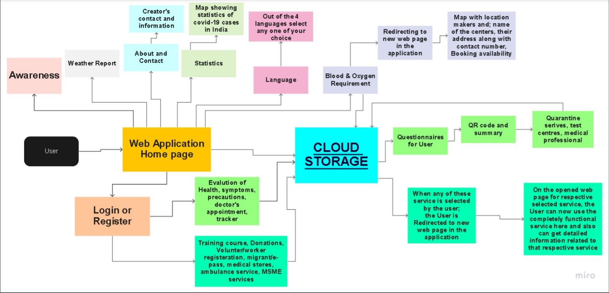
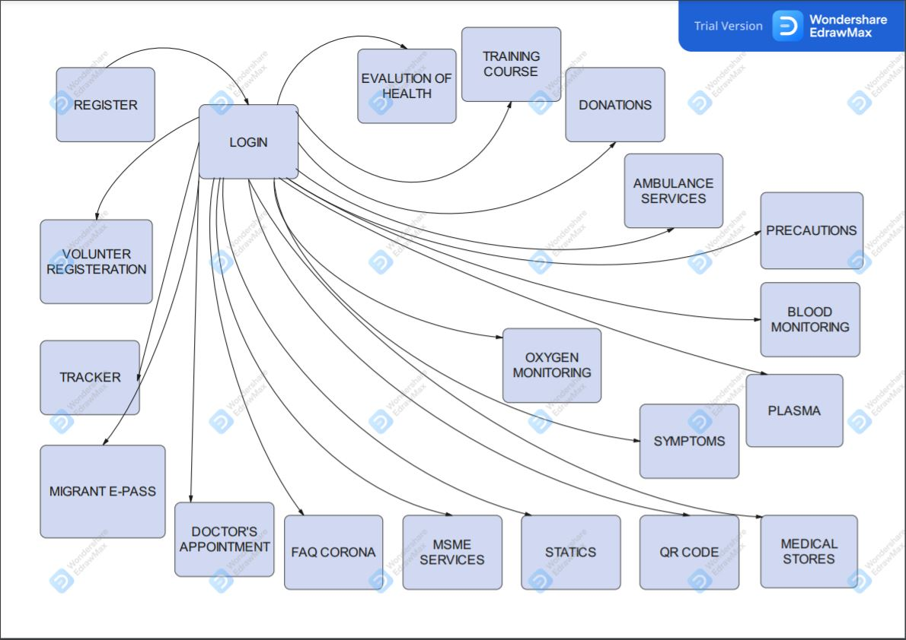

# VirusBaba using Django

## Title: 
Virus Baba

## Description: 
Virus Baba is a mobile responsive Web application  which facilitates every individual in India with the essential services during this COVID-19 pandemic. In this growing age of technology, India has launched a campaign, "Digital India". With this motivation, "Virus Baba" is also a contribution towards building a Digital India while also improving the infrastructure to facilitate services online.
The mobile responsive Web application facilitates services like Evaluation of Individual health by generating a Susceptibility score and testing of an Individual, Helping Vulnerable Categories, Vocational Online Training, Quarantine Services, Barcode issuing services, Finding Medical stores and Hospitals in a city, Dynamic Visualizations to understand the behaviour of this Virus, Multiple Language support, MSME Products and Services, Volunteering, Weather Report and Links for the Government Services.

## Software Requirements:
* A terminal having Python version 3.8 or above installed.
* Installed all the modules mentioned in <code>requirements.txt</code>.
* The web application can be deployed in pythonanywhere.com or Heroku.
* Browser should be JavaScript enabled.

## Process Flow:

## Data Flow Diagram:

## Link:
https://virus-baba.herokuapp.com/

